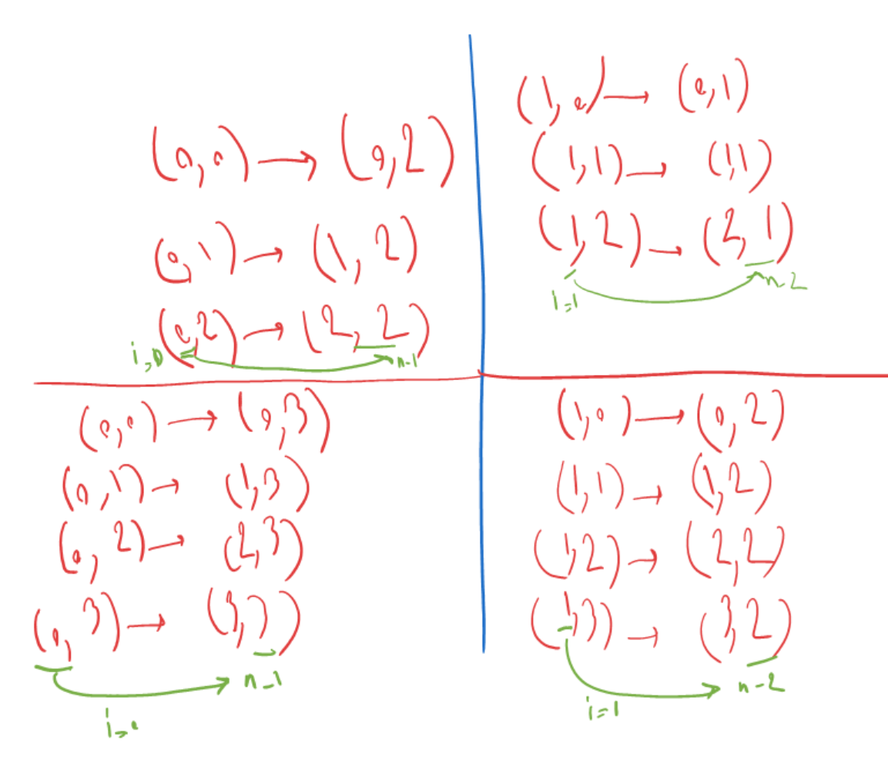

# [48. Rotate Image](https://leetcode.com/problems/rotate-image)

## Description

You are given an <code>n x n</code> 2D <code>matrix</code> representing an image, rotate the image by <strong>90</strong> degrees (clockwise).

You have to rotate the image <a href="https://en.wikipedia.org/wiki/In-place_algorithm" target="_blank"><strong>in-place</strong></a>, which means you have to modify the input 2D matrix directly. <strong>DO NOT</strong> allocate another 2D matrix and do the rotation.

&nbsp;

<strong class="example">Example 1:</strong>

<pre>
<strong>Input:</strong> matrix = [[1,2,3],[4,5,6],[7,8,9]]
<strong>Output:</strong> [[7,4,1],[8,5,2],[9,6,3]]
</pre>

<strong class="example">Example 2:</strong>

<pre>
<strong>Input:</strong> matrix = [[5,1,9,11],[2,4,8,10],[13,3,6,7],[15,14,12,16]]
<strong>Output:</strong> [[15,13,2,5],[14,3,4,1],[12,6,8,9],[16,7,10,11]]
</pre>

&nbsp;

<strong>Constraints:</strong>

<ul>
	<li><code>n == matrix.length == matrix[i].length</code></li>
	<li><code>1 &lt;= n &lt;= 20</code></li>
	<li><code>-1000 &lt;= matrix[i][j] &lt;= 1000</code></li>
</ul>

## Solutions
This problem is just matter of playing with indices. We can solve it by two steps:    
first we flip the matrix upside down. so for that we move to the half of the matrtix and change the `matrix[i][j]` with `matrix[n-i-1][j]`.    
then we flip the matrix diagonally. so for that we move to the diagonal-half of the matrtix and change the `matrix[i][j]` with `matrix[j][i]`.    
if you write down the indices, you see why. for example, I wrote down indices for the first two example in the following image. Sorry for my bad handwriting. I was just taking a note for myself.
