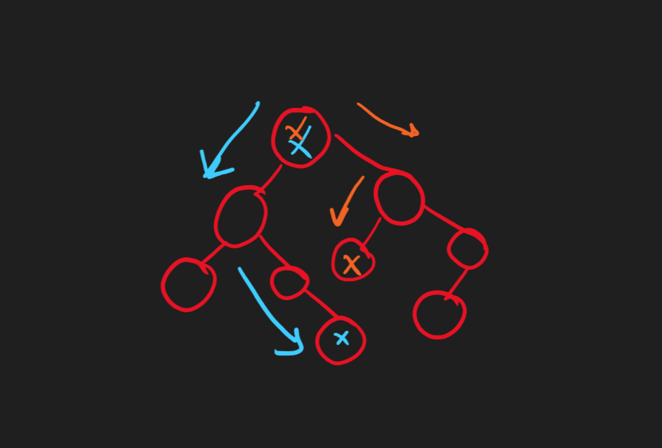

# [530. Minimum Absolute Difference in BST](https://leetcode.com/problems/minimum-absolute-difference-in-bst)

<!-- tags:Tree,Depth-First Search,Breadth-First Search,Binary Search Tree,Binary Tree -->

## Description

Given the <code>root</code> of a Binary Search Tree (BST), return <em>the minimum absolute difference between the values of any two different nodes in the tree</em>.

&nbsp;

<strong class="example">Example 1:</strong>

<pre>
<strong>Input:</strong> root = [4,2,6,1,3]
<strong>Output:</strong> 1
</pre>

<strong class="example">Example 2:</strong>

<pre>
<strong>Input:</strong> root = [1,0,48,null,null,12,49]
<strong>Output:</strong> 1
</pre>

&nbsp;

<strong>Constraints:</strong>

<ul>
	<li>The number of nodes in the tree is in the range <code>[2, 104]</code>.</li>
	<li><code>0 &lt;= Node.val &lt;= 105</code></li>
</ul>

&nbsp;

<strong>Note:</strong> This question is the same as 783: <a href="https://leetcode.com/problems/minimum-distance-between-bst-nodes/" target="_blank">https://leetcode.com/problems/minimum-distance-between-bst-nodes/</a>

## Solutions
Since we are working with `binary search tree` for each node, the `min` difference can be found based on the following image:      
      
now either you can use while loop (Solution1.java) or you can use recursion (Solution2.java) to solve this problem.
